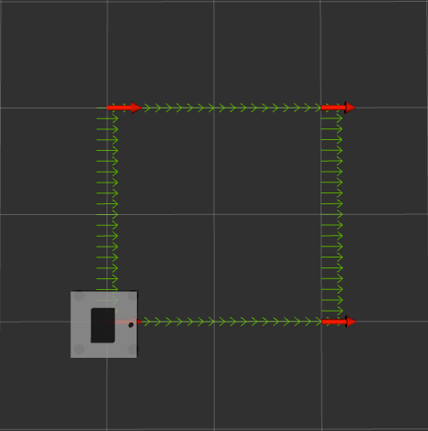

# Waltzing robot

Make a planar mobile robot follow choreography using waypoints

## Dependencies
- [ropod_sim_model](https://github.com/ropod-project/ropod_sim_model)

## Waypoint choreography (under development)

### Trajectory using linear velocity

### Trajectory using trapezoid velocity curve

